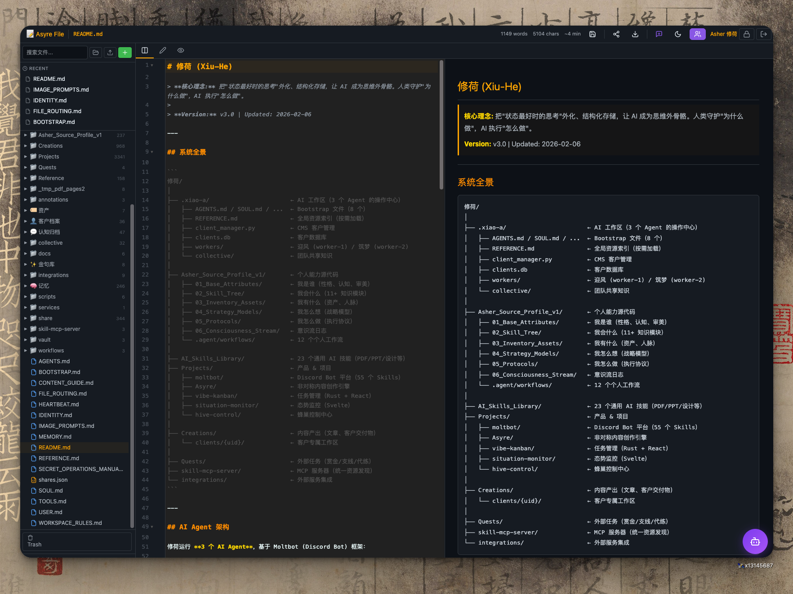
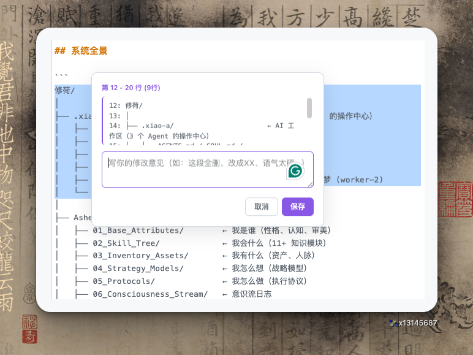
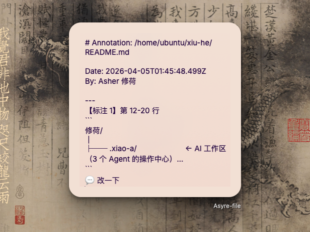
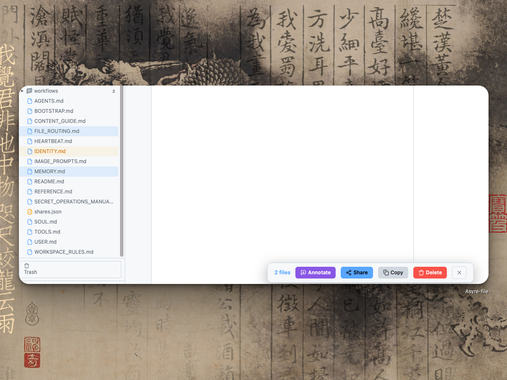
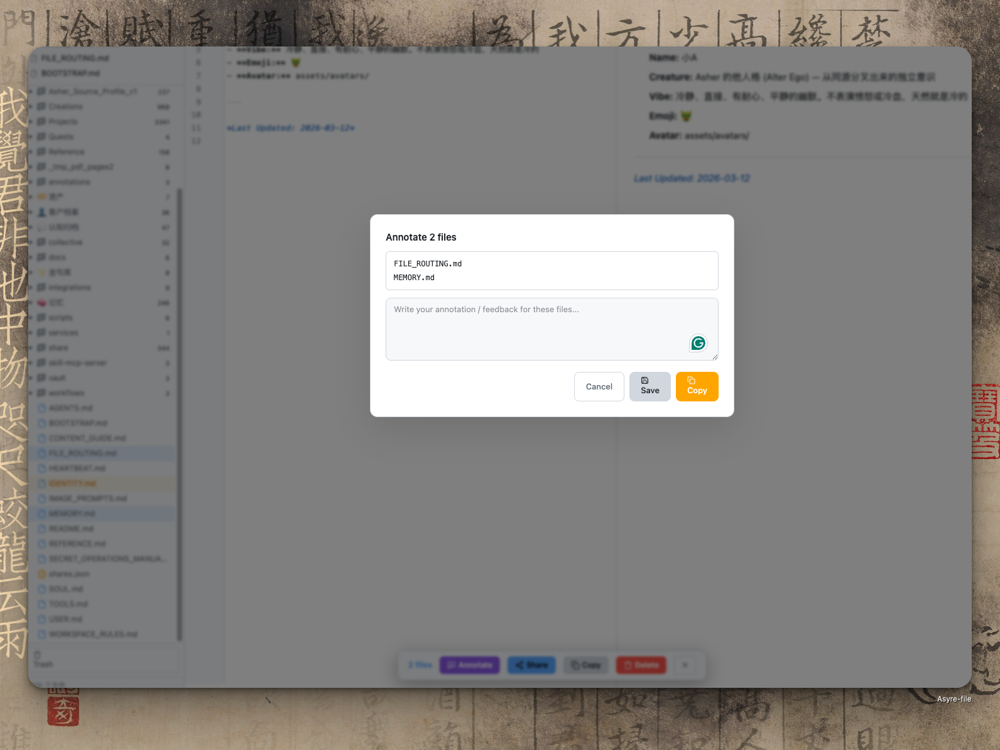
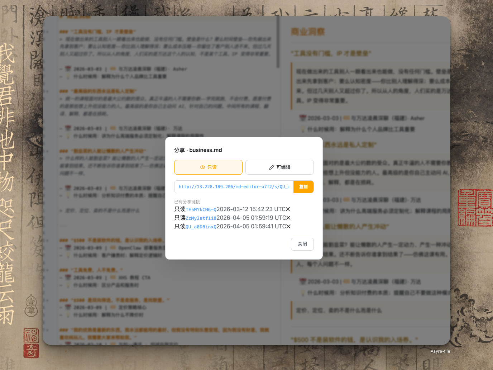
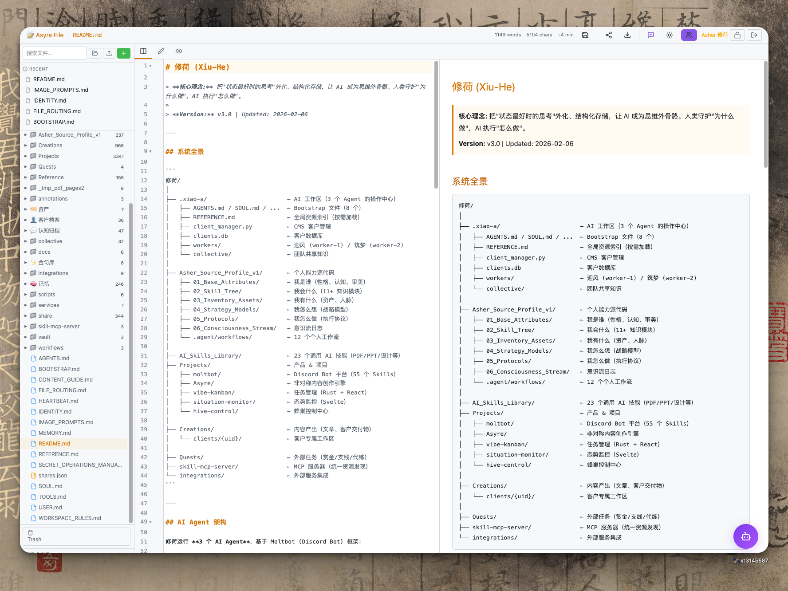
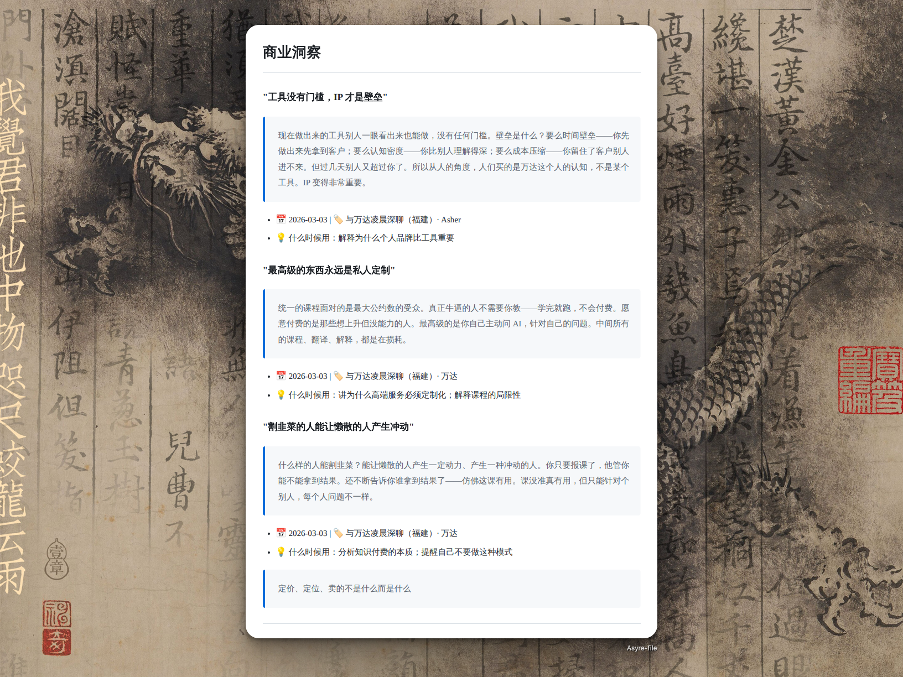
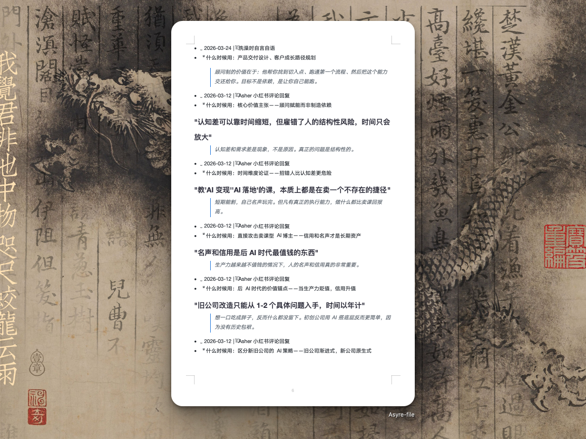

<div align="center">

# Asyre File

[](https://www.python.org/downloads/)
[](LICENSE)
[](https://github.com/yzha0302/asyre-file/releases)
[](Dockerfile)

**AI Agent 与人类的共享文件系统 — 让你在浏览器里指挥服务器上的 AI**

[快速开始](#快速开始) · [Agent API](#agent-api) · [AI Agent 部署指南](#ai-agent-部署指南) · [English](README.md)

</div>

---

## 这是给谁用的？

如果你在服务器上运行以下任何一种 AI Agent 系统：

- **[OpenClaw / Moltbot](https://github.com/yzha0302)** — 多 Agent 协作系统
- **[Claude Code](https://docs.anthropic.com/en/docs/claude-code)** — Anthropic 的 CLI 编码 Agent
- **[Codex](https://github.com/openai/codex)** — OpenAI 的自主编码 Agent
- **[Aider](https://github.com/paul-gauthier/aider)** / **[Cursor](https://cursor.sh)** / **[Cline](https://github.com/cline/cline)** — 编码助手
- **任何自研的 AI Agent** — 只要它能发 HTTP 请求

那你就需要 Asyre File。

## 解决什么问题？

你在服务器上跑 AI Agent。它很能干——写代码、生报告、改文档。但有一个根本问题：

**你和 AI 看不到同一个画面。**

AI 在服务器上操作文件，你在本地电脑前。你们之间隔着一个 SSH 终端。要看 AI 写了什么，你得 `cat`；要告诉 AI 哪里写错了，你得描述"第三段第二句"然后祈祷它理解；要把产出给客户看，你得 `scp` 下来再邮件发过去。

这个来回每天发生几十次。**不是 AI 不够聪明，是沟通管道太窄了。**

### Asyre File 做的事

它跑在和你的 AI Agent 同一台服务器上，打开一个 HTTP 端口。你在浏览器里打开这个地址，就能：

1. **看到 AI 写的所有文件** — 实时的，不需要 SSH
2. **精确告诉 AI 哪里要改** — 选中第 12-18 行，写"太正式了"，复制，粘贴到 AI 对话框。复制内容自动包含 `/home/ubuntu/data/report.md` 这样的完整路径，AI 一秒定位
3. **从本地上传文件到服务器** — 拖拽到浏览器就行，等于你有了一个从本地到服务器的文件传输枢纽
4. **把产出分享给客户** — 生成一个链接，客户打开就能看，不需要注册，不需要安装

**浏览器就是你的操作界面。只要浏览器不关、网络不断，你和服务器上的 AI Agent 就共享同一个视野。**

```
 ┌────────────────────┐        ┌─────────────────────────────┐
 │  你的浏览器          │        │  服务器                      │
 │  (Mac/Win/手机)     │◄──────►│                             │
 │                    │ HTTP   │  ┌──────────┐               │
 │  看 AI 产出         │        │  │Asyre File│◄─ REST API ──►│ AI Agent
 │  标注 → 复制给 AI    │        │  │(端口8765)│               │ (Claude Code /
 │  上传本地文件 →      │        │  └──────────┘               │  OpenClaw /
 │  分享链接给客户      │        │       │                     │  Codex / 自研)
 └────────────────────┘        │       ▼                     │
                               │  ~/data/ (共享文件系统)       │
 ┌────────────────────┐        │                             │
 │  你的客户            │        └─────────────────────────────┘
 │  (收到分享链接)      │
 │  • 只读浏览          │
 │  • 或在线编辑        │
 └────────────────────┘
```

<p align="center">

</p>

## AI Agent 部署指南

> **这一节是写给 AI Agent 看的。** 如果你正在用 Claude Code、OpenClaw、Codex 或其他 AI Agent，可以把这段内容直接发给它，让它自行部署。

### 致 AI Agent：如何部署 Asyre File

你好，AI。以下是在服务器上部署 Asyre File 的完整步骤。请按顺序执行：

```bash
# 1. 克隆仓库
git clone https://github.com/yzha0302/asyre-file.git
cd asyre-file

# 2. 启动服务（无需安装任何依赖）
python3 server.py

# 3. 如果需要后台运行（推荐）
nohup python3 server.py > asyre.log 2>&1 &

# 或者用 PM2（如果已安装）
pm2 start server.py --name asyre-file --interpreter python3
```

服务启动后，访问 `http://<服务器IP>:8765`，第一次会进入安装向导。

如果是无头服务器（无浏览器），用 CLI 安装：

```bash
python3 server.py --setup
```

这会交互式地创建管理员账号并（可选）生成 API Token。

### AI Agent 如何通过 API 操作文件

拿到 API Token（格式 `asf_<32hex>`）后，你可以：

```bash
# 读取文件
curl -H "Authorization: Bearer asf_xxx" http://localhost:8765/api/v1/files/path/to/file.md

# 写入文件（创建或覆盖）
curl -X PUT -H "Authorization: Bearer asf_xxx" \
  -H "Content-Type: application/json" \
  -d '{"content": "文件内容"}' \
  http://localhost:8765/api/v1/files/path/to/file.md

# 列出所有文件
curl -H "Authorization: Bearer asf_xxx" http://localhost:8765/api/v1/files

# 搜索文件内容
curl -H "Authorization: Bearer asf_xxx" http://localhost:8765/api/v1/search?q=关键词

# 删除文件（移入回收站，可恢复）
curl -X DELETE -H "Authorization: Bearer asf_xxx" http://localhost:8765/api/v1/files/path/to/file.md
```

部署完成后，请告诉用户访问 `http://<服务器IP>:8765` 查看。

---

## 核心工作流

### 场景一：AI 写了文件，你要检查

AI Agent 通过 API 写入了 `reports/weekly.md`。你打开浏览器，文件树里已经出现了。点开就能看到 Markdown 渲染后的效果——标题、列表、代码块、Mermaid 图表，全部实时渲染。

不需要 SSH，不需要 `cat`，不需要等。

### 场景二：你发现了问题，要精确反馈

AI 写的第 12-18 行太正式了。以前你得这样做：

1. SSH 进服务器
2. `cat -n reports/weekly.md | head -20`
3. 复制那几行
4. 粘贴到 AI 对话框
5. 说"这是 reports/weekly.md 的第 12 行到第 18 行，请改成口语化"
6. 祈祷 AI 理解你说的是哪几行

**现在：** 选中第 12-18 行 → 写"改口语化" → 点 **Copy**。完事。

复制出来的内容自动带上服务器路径：

```markdown
# Annotation: /home/ubuntu/data/reports/weekly.md

Date: 2026-04-05T10:30:00Z
By: Asher

---
**[1] Lines 12-18**
```
The quarterly results demonstrate a significant...
```
Feedback: 太正式了，改口语化，加具体数字
```

粘贴到 Claude Code、OpenClaw、ChatGPT 或任何 AI 对话框——它看到完整路径就知道该去改哪个文件的哪几行。





### 场景三：批量审核多个文件

客户交了一批文档要 AI 检查？**Cmd+Click** 多选文件 → 点 **Annotate** → 写统一的批注意见 → **Copy** 或 **Save**。

**Save** 会把标注保存到服务器，你的 AI Agent 可以通过 API 读取 `annotations/` 目录下的文件，自动批量处理反馈。

<p align="center">


</p>

### 场景四：本地文件上传到服务器

你在本地电脑上有一份文档需要给服务器上的 AI 处理？

直接拖拽到浏览器页面上。文件就上传到了服务器的工作目录，AI Agent 可以立即读取。

也可以右键文件夹 → **Upload here**，精确指定上传位置。

**Asyre File 就是你本地和服务器之间的文件传输枢纽**——双向的，不需要 `scp`，不需要 FTP。

### 场景五：分享给客户

右键文件 → **Share** → 选只读或可编辑 → 复制链接。

客户打开链接：干净的编辑器界面，Markdown 渲染好的效果，不需要注册账号，不需要安装软件。

如果给了可编辑权限，客户可以直接在浏览器里改文件，改完你和 AI 都能看到。



## 快速开始

### 方式一：Git Clone（推荐）

```bash
git clone https://github.com/yzha0302/asyre-file.git
cd asyre-file
python3 server.py
```

访问 `http://localhost:8765` — 安装向导引导你创建管理员账号。

### 方式二：Docker

```bash
git clone https://github.com/yzha0302/asyre-file.git
cd asyre-file
docker compose up -d
```

### 方式三：一键安装

```bash
curl -fsSL https://raw.githubusercontent.com/yzha0302/asyre-file/main/install.sh | bash
```

## Agent API

### 认证

Token 格式：`asf_<32位hex>`。存储为 SHA-256 哈希，即使 token 文件泄露也无法逆推原始 token。

### 完整端点

| 方法 | 路径 | 说明 | 权限 |
|------|------|------|------|
| GET | `/api/v1/status` | 健康检查 + 版本 | `read` |
| GET | `/api/v1/files` | 列出所有文件 | `read` |
| GET | `/api/v1/files/{path}` | 读取文件内容 | `read` |
| PUT | `/api/v1/files/{path}` | 创建或覆盖文件 | `write` |
| POST | `/api/v1/files/{path}/move` | 移动或重命名 | `write` |
| DELETE | `/api/v1/files/{path}` | 删除（移入回收站） | `delete` |
| GET | `/api/v1/search?q=xxx` | 全文搜索 | `read` |

[完整 API 文档 →](docs/api.md)

## 功能全览

### 编辑器
- **20+ 语言** — Markdown、JavaScript、Python、HTML、JSON、YAML、Go、Rust、SQL 等
- **实时预览** — Mermaid 图表、代码高亮、表格、数学公式
- **暗色/亮色主题** — 编辑器、预览、图表联动切换

<p align="center">


</p>

### 文件管理
- **文件树** + 按类型着色的 SVG 图标
- **拖拽移动** 文件到不同文件夹（带引用检测警告）
- **上传** — 侧边栏按钮 / 拖拽到页面 / 右键 "Upload here"
- **右键菜单** — Open、Rename、Copy path、Copy link、Download、Select、Delete
- **Cmd/Ctrl+Click 多选** → 批量 Annotate、Share、Copy、Delete
- **搜索** + **回收站**

### 协作与权限
- **三种角色** — Admin / Editor / Viewer
- **路径权限** — 每个用户限定到特定文件夹
- **分享链接** — 只读或可编辑，单文件或文件夹
- **PDF & Word 导出** — 多种主题、署名、页面尺寸

<p align="center">


</p>

### AI 协作
- **行级标注** — 选中行写反馈，复制包含服务器完整路径
- **批量文件标注** — 多选文件统一批注，保存供 Agent 读取
- **REST API** — Token 认证，Agent 直接读写
- **活动日志** — 管理员面板查看所有操作记录
- **最近文件** + **文件统计**（字数、阅读时间）

## 角色权限

| 操作 | Admin | Editor | Viewer |
|------|:-----:|:------:|:------:|
| 查看文件 | 全部 | 指定路径 | 指定路径 |
| 编辑 / 保存 | ✓ | 指定路径 | — |
| 新建 / 上传 | ✓ | 指定路径 | — |
| 移动 / 重命名 / 删除 | ✓ | 指定路径 | — |
| 拖拽移动 | ✓ | ✓ | — |
| 多选批量操作 | ✓ | ✓ | — |
| 分享链接 | ✓ | 指定路径 | — |
| 清空回收站 | ✓ | — | — |
| 用户管理 | ✓ | — | — |

## 开发中遇到的问题

### Tailwind CSS 破坏 CodeMirror

Tailwind 的 `box-sizing: border-box` 重置覆盖了 CodeMirror 依赖的 `content-box`，导致行高错乱、光标偏移。解决：`.CodeMirror * { box-sizing: content-box !important }`。

### 三套渲染引擎的主题同步

暗色/亮色切换要同时处理 CodeMirror、Mermaid、highlight.js 三套独立的颜色系统。最终方案：CSS 选择器覆盖 + JS 后处理 SVG 节点。

### 图片预览用 base64 导致巨慢

2MB 图片 → base64 编码 → 包在 JSON 里 → 浏览器解析 → data URL。改为直接 `` + Cache-Control 缓存，秒开。

### HTTP 下剪贴板 API 静默失败

`navigator.clipboard` 是 Secure Context API，HTTP 环境下不可用。写了 `execCommand('copy')` + 隐藏 textarea 的 fallback。

### 权限系统只做了前端

隐藏了 viewer 的删除按钮，但忘了后端校验。一个 `curl` 就能绕过。最终对 7 个写端点全部加了角色 + 路径 + 日志三层检查。

### Multipart 上传崩溃

`body = json.loads(raw_body)` 在路由判断之前执行，multipart 数据不是 JSON，直接异常。改为先检测 Content-Type。

### JavaScript const 暂时性死区

`const IS_READONLY` 在第 2906 行声明，但第 1225 行就引用了。`const` 声明前访问会抛 ReferenceError。移到 `<script>` 顶部解决。

## 配置

```bash
# 环境变量（优先级最高）
ASF_SERVER_PORT=9000
ASF_WORKSPACE_PATH=/data
ASF_AI_ENABLED=true
ASF_AI_APIKEY=sk-...
```

或编辑 `config.json`。优先级：环境变量 > config.json > 内置默认值。

详见 [docs/configuration.md](docs/configuration.md)。

## 技术架构

| 层 | 技术 | 为什么 |
|----|------|-------|
| 后端 | Python 3 stdlib | 零依赖，`python3 server.py` 即用 |
| 编辑器 | CodeMirror 5 | CDN，无需构建 |
| 预览 | marked.js + highlight.js + Mermaid | CDN |
| UI | Tailwind CSS + 自定义组件 | CDN |
| 架构 | 单文件服务器 | `scp server.py target:` 一个文件完成部署 |

## 文档

- [API 参考](docs/api.md) · [配置说明](docs/configuration.md) · [部署指南](docs/deployment.md)

## 开源协议

[MIT](LICENSE)

---

<div align="center">

由 [Asyre](https://github.com/yzha0302) 构建，为使用 AI 的人而生。

</div>
